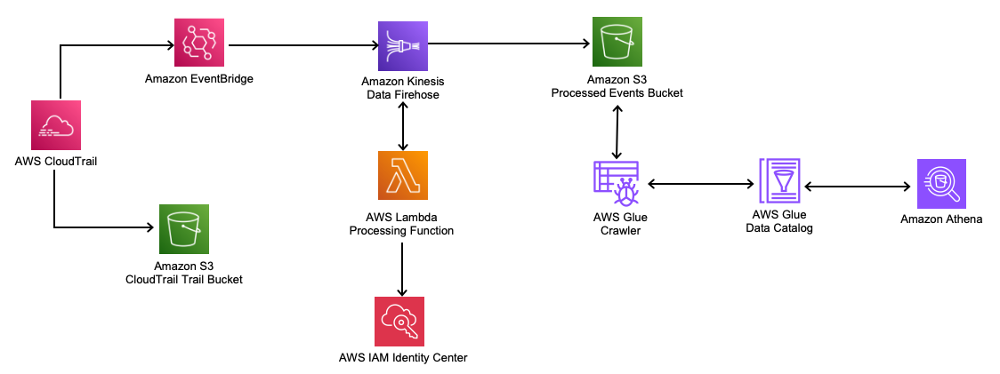

# Usage Analyzer for Amazon CodeWhisperer

The [AmazonCodeWhisperer](https://aws.amazon.com/codewhisperer/) usage analyzer is used to perform analysis on code suggestions and security scans for Organizations using the CodeWhisperer professional tier.

Once deployed all code suggestions and security scans will publish metrics into a data pipeline, which will make the information readily available to query via [Amazon Athena](https://aws.amazon.com/athena/). With these metrics you can write queries that are capable of reporting on usage and attributing total spend to a particular user or group.



## Deploying

*Please note that this solution will need to be deployed into the same account as your CodeWhisperer Professional profile was configured.*

1. Clone the repository
2. Install the AWS Cloud Developer Kit (AWS CDK). Full instructions can be found [here](https://docs.aws.amazon.com/cdk/v2/guide/getting_started.html#getting_started_install).
```
npm install -g aws-cdk
```
3. Install dependencies 
```
pip install -r requirements.txt
```
4. Bootstrap CDK
```
cdk bootstrap aws://ACCOUNT-NUMBER/REGION
```
5. **(Optional)** Access the [AWS IAM Identity Center](https://aws.amazon.com/iam/identity-center/) in the console. Under the **Application assignments** menu on the left hand side select *Applications*. Select the **CodeWhispererDefaultProfile** application. For each group click on the **Group name** and make a note of the **Group ID**. Collate them together using the below command.
```
export SSO_GROUP_IDS="GROUP_ID_1,GROUP_ID2,GROUP_ID_N"
```
6. Deploy the CDK Stack in your AWS account (ignoring the context flag if you did not complete step 5)
```
cdk deploy --context sso_group_ids=$SSO_GROUP_IDS
```

## Example Queries

Below are some example queries which can be used to get common results. If you are not seeing all of the expected results, please ensure that the AWS Glue Data Crawler has triggered for the day. It is scheduled to run once per hour to identify new partitions.

Please note that the following fields require specifying at least one group in the **SSO_GROUP_IDS** variable during deployment: "user_name", "group_id", "group_name"

### How many unique users used CodeWhisperer this month?

```sql
SELECT
    COUNT(DISTINCT "user_id") as total_unique_users
FROM
    "codewhisperer_events"."codewhispererevents"
WHERE
    year='2023'
AND
    month='08'
LIMIT 10;
```

### Who has used CodeWhisperer this month?

```sql
SELECT
    DISTINCT "user_name"
FROM
    "codewhisperer_events"."codewhispererevents"
WHERE
    year='2023'
AND
    month='08'
LIMIT 10;
```

### What has been my most popular language?

```sql
SELECT
    "programming_language",
    COUNT(*) as "language_count"
FROM
    "codewhisperer_events"."codewhispererevents"
WHERE
    year='2023'
AND
    month='08'
AND
    "programming_language" IS NOT NULL
GROUP BY
    "programming_language"
ORDER BY
    "language_count" DESC
LIMIT 10;
```

### How are unique users split across groups?

```sql
SELECT
    "group_name",
    COUNT(DISTINCT "user_id") as "total_users"
FROM
    "codewhisperer_events"."codewhispererevents"
WHERE
    year='2023'
AND
    month='08'
GROUP BY
    "group_name",
    "user_id"
LIMIT 10;
```

### How many security scans have we run?

```sql
SELECT
    "event_type",
    COUNT(*) as "total_scans"
FROM
    "codewhisperer_events"."codewhispererevents"
WHERE
    year='2023'
AND
    month='08'
AND
    "event_type"='SecurityScanInvocation'
GROUP BY
    "event_type"
LIMIT 10;
```

## Cost Estimation

There are a number of services involved in the architecture (please see above). The following pricing items will need to be considered.

* [AWS CloudTrail](https://aws.amazon.com/cloudtrail/pricing/) - CodeWhisperer data events are used to capture the elements for this solution. Trails with data events carry charge to be delivered to an S3 bucket.
* [Amazon S3](https://aws.amazon.com/s3/pricing/) - S3 charges are used for storing the CloudTrail events and the processed events. If you do not need the data to persist forever, consider your [storage lifecycle](https://docs.aws.amazon.com/AmazonS3/latest/userguide/object-lifecycle-mgmt.html).
* [Amazon Kinesis Data Firehose](https://aws.amazon.com/kinesis/data-firehose/pricing/) - Firehose charges per ingestion per GB. This will vary by the total events (code generation and security scans) generated in CodeWhisperer
* [AWS Lambda](https://aws.amazon.com/lambda/pricing/) - The Lambda function included is used to process requests in Firehose. Each function invoked will bundle multiple records at one time. The Lmabda is configured to use Arm64 processor with a memory configuration of 512MB.
* [AWS Glue](https://aws.amazon.com/glue/pricing/) - The Glue Crawler used in this solution runs once every 6 hours
* [Amazon Athena](https://aws.amazon.com/athena/pricing/) - Athena pricing will vary based on query usage over the month

To get a more accurate understanding, please use the [AWS Pricing Calculator](https://calculator.aws/#/addService) providing your estimated usage.

## Security

See [CONTRIBUTING](CONTRIBUTING.md#security-issue-notifications) for more information.

## License

This library is licensed under the MIT-0 License. See the LICENSE file.

